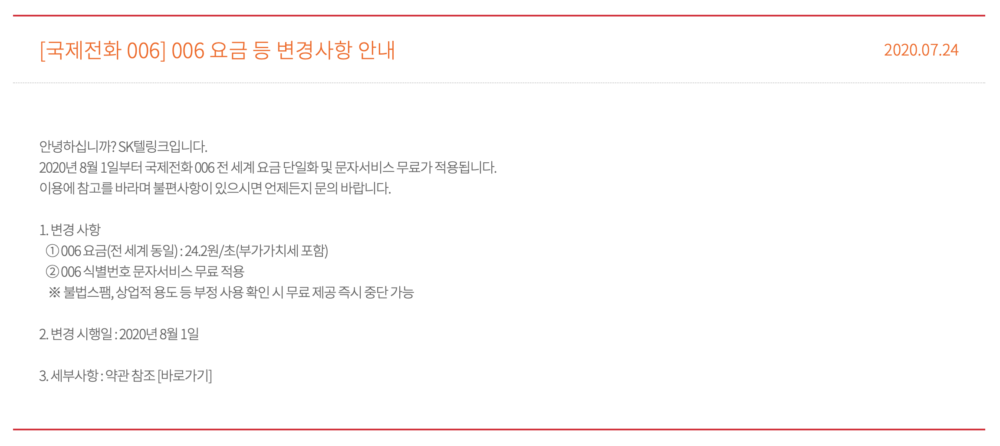

## 구현 계기
아래 그림과 같은 기능을 구현하고 싶었습니다.

먼저 국내에 이런 서비스가 존재하는지 확인을 해보았는데, 기존 통신사에서 인터넷전화를 제공하고 이와 관련된 API도 제공은 하는거 같은데 약정같은것도 해야되고 명확한 정보들을 찾지 못하였습니다. 대학생 수준의 프로젝트이고 개발과정이라서 통신사 약정같은것은 너무 부담이 되었습니다.

그래서 해외까지 찾아보니 `Twilio`라는 회사를 발견하게 되었습니다. 이 회사는 메세지, 인증, 보이스등의 서비스를 제공해주는 [CPaaS](https://www.forbes.com/advisor/business/software/what-is-cpaas/) 회사입니다.

찾아보니 Twilio는 `webhook`을 이용해서 내 Twilio 전화로 온 발신자의 정보를 POST해주는 기능을 지원하는것을 확인하였고, 관련 Twilio설정을 마친후, 직접 제가 Twilio로 부터 받은 전화번호로 전화를하니 성공적으로 서버로 발신자 번호가 넘어가는것을 확인하였습니다.
## 기능 도입 과정
### 1. Twilio 회원가입과 기본 세팅
http://twilio.com 

회원가입하면 체험용(Trial) 계정을 줍니다. 저는 [이 블로그](https://compogetters.tistory.com/entry/javaspringtwilio를-이용해서-전화솔루션-구축하기-비상연락망) 를 참고하여 여러 설정을 완료하였습니다. 해당 블로그를 참고하되 아래의 주의사항도 같이 봐주세요.
#### 본인 휴대전화 인증할때 +8210 으로
본인 휴대전화 인증할때 +8201012341234 가 아니라 +821012341234로 해주셔야합니다. +82010을 하니 계정의 문자 인증이 까지는 되는데 그 이후 Twilio 서비스를 이용할때 번호를 인식을 못하는것을 경험하였습니다. +8210으로 다시 인증받으니 제대로 사용이 가능했습니다.

#### 전화번호 구매 필요 X

전화번호 구입안하셔도 됩니다. 그냥 주는 번호 이용하셔도 무방합니다.
#### Voice Geographic Permissions 가서 한국 허용
Twilio Console 에서 왼측 사이드바에서 `Voice->Setting->Geo permissions` 에서 **한국 허용** 해주세요


### 2. Twilio의 POST요청 받을 서버 준비
저는 Spring을 AWS로 배포하였습니다. 그리고 아래와 같은 코드를 준비하였습니다.
```java
@RestController  
public class CallController {  
    private static final Logger log = LoggerFactory.getLogger(CallController.class);  
  
    @PostMapping("/call")  
    public void callCheck(@RequestParam Map<String, String> allParams) {  
  
        String fromNumber = allParams.get("From");  
        String toNumber = allParams.get("To");  
  
        // 받은 전화번호와 다른 정보를 로그로 출력하거나, 다른 로직을 추가로 처리할 수 있습니다.  
        log.info("Incoming call from: " + fromNumber + " to: " + toNumber);  
  
    }  
}
```
Twilio에서 `{baseURL}/call` 로 POST 요청을 할때 처리할 코드입니다. `From`이 발신자의 번호입니다. `To`는 제 Twilio번호입니다.
### 3. Twilio에서 POST요청 할 주소 설정
>번호, URL은 가렸습니다

#### 3-1 스크린샷처럼 Active Numbers로가서 할당받은 번호 클릭


#### 3-2 A call comes in 의 URL에 POST 받을 URL 기입


### 4. 전화걸기
1. Twilio 에서 받은 번호로 전화를 겁니다(전 이번에 처음으로 해외로 전화해봤습니다 ㅎㅎ) 
	- 미국으로 전화를 걸어야되기때문에 저는 `006 1 {Twilio에서 받은 번호}`이렇게 전화를 걸었습니다.
2. 전화걸리면 어떤 여성의 멘트를 들을 수 있습니다. **이때! 멘트가 끝나기전에 바로 아무 번호 입력해주세요!!!** 
계정을 upgrade하면 이런거 안해도 되지만 체험용 계정을 사용중이라면 아무 번호를 입력하는 과정이 필요합니다.

> [주의]
> 
> Trial 계정은 전화걸자마자 **아무 번호를 입력**하셔야 됩니다

### 5. Spring Log 확인
> 번호는 가렸습니다.

AWS ec2에 ssh로 접속하고 Spring log 를 보면 아래와같이 찍혀있는것을 확인할 수 있습니다.

```bash
Incoming call from: +82109****346 to: +12******847
```
## 팁

### 국제전화 요금은 어떻게 되지?
006은 SKT의 식별번호 입니다. 1은 미국의 식별번호입니다. 우리나라는 82인것처럼 미국은 1을 쓰는것입니다. 처음 해외에 전화를 걸어서 요금이 걱정되어 찾아보았는데요. 아래 링크로 가면
https://www.sktelink.com/view/customer/notice_contents/205?page_num=1



10초 정도 통화하면 240원... 비싸긴한데 다행히 저의 목적은 발신자 번호를 서버로 넘기는것이기 때문에 그냥 Twilio에서 받자마자 끊으면 되어서 국제전화라도 큰 부담은 안 생길것 같습니다.
### 전화를 해도 Twilio에서 POST를 안해주던 문제

https://www.twilio.com/docs/messaging/guides/how-to-use-your-free-trial-account#making-phone-calls Twilio의 공식문서를 보면 아래와 같은 내용이 있습니다.

**해석**

무료 평가판 전화번호로 전화를 걸거나 받으면 TwiML이 실행되기 전에 짧은 평가판 메시지가 재생됩니다.
이 메시지에서 통화를 진행하려면 아무 키나 누르세요. 키를 누른 후에만 웹사이트의 코드가 요청됩니다.
키를 누르지 않으면 통화가 코드에 연결되지 않습니다.

그냥 console에 적어주었으면 좋았을텐데, 문서에 적어놓아서 한참 해매었습니다. 또 전화를 해도나오는 멘트가 빠르고 음질이 안좋아서 뭐라는지 제대로 못알아 듣겠더군요(제 리스닝이 부족한걸수도)

### Twilio 에 전화하면 나오는 멘트를 어떻게 변경하지?
https://www.twilio.com/docs/voice/tutorials/how-to-respond-to-incoming-phone-calls/java

이 문서를 보시면 됩니다.

## 참고자료

- https://www.twilio.com/docs/messaging/guides/how-to-use-your-free-trial-account
- https://www.twilio.com/en-us/voice/pricing/kr
- https://help.twilio.com/articles/223183548 환불 관련
- https://compogetters.tistory.com/entry/javaspringtwilio를-이용해서-전화솔루션-구축하기-비상연락망
- 멘트수정방법 https://www.twilio.com/docs/voice/tutorials/how-to-respond-to-incoming-phone-calls/java
