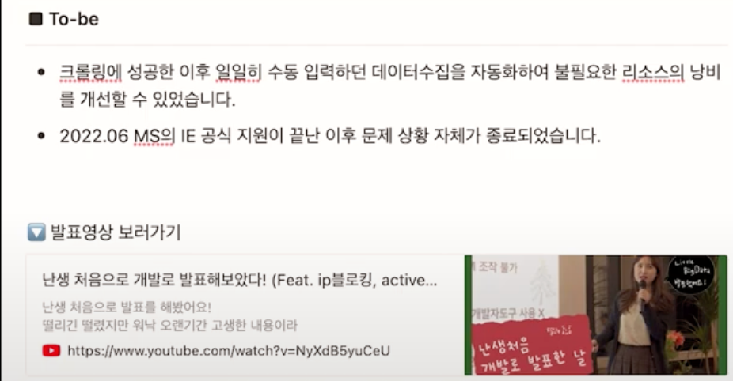

## 1차 이력서 피드백

OKKY 에서 19년차 개발자분이 무료로 멘토링해주신다는 글을 보고 카톡으로 연락을 드리고 막 완성한 이력서와 포트폴리오를 전달드렸다. 곧 답장이 오셨는데 전화번호를 알려달라 하셔서 처음에는당황하였다. 무료로
해주신다해서 그냥 카톡으로 해주시고 마는줄 알았는데 전화까지 주셨다. 좋은 기회여서 바로 전화번호를 드렸고, 그리하여 전화로 멘토링을 받게되었는데...

100% 떨어지는 이력서라고 먼저 말씀해주셔서 사고가 멈추었었다. 사실 이정도면 준수한거 아닌가라고 생각을하고 있었는데... 100%떨어진다고 말씀주신후에 그 이유를 들으니 충분히 납득이 갔다. 정리하자면 이렇다.

- 포트폴리오가 장황하다. 블로그에 넣어야될 내용이다.
- 이력서에 포인트가없다. 니가 기획한거 관심없다.
- 이력서에 내가 할 줄 아는걸 넣어라. 교육에서는 뭘 배웠는지 기술하라.
- 많은거 할줄 아는게 자랑이 아니다. 내가 만든 익스텐션, 프론트부분은 어느정도 실력있는 개발자면 충분히 하기에 임팩트를 못준다. 기본에 충실하라
  대강 이렇다.

하~ 솔직히 멘토링 후 1시간 동안은 좀 울적했었는데 이후에는 이렇게 피드백을 받으니 앞으로 할 일이 명확해져서 좋은거 아니겠냐하는 마인드로 바꾸고 다시 처음부터 이력서와 포트폴리오를 만들기 시작했다. 참
감사한분이다. 마지막에 요즘 경기가 최악이니 포기하지말고 해라는 말씀도 해주시고 너무 감사했다.

## 2곳 중 1곳은 무조건 합격하는 개발자 이력서 만들기

[링크](https://www.youtube.com/watch?v=ifGUz43GjdQ&ab_channel=%EC%9D%B8%ED%94%84%EB%9F%B0inflearn)

- 마음가짐: 낙담하지 않기. 중꺽마...
- 이력서는 dry doc. 미사여구 노
- 컴팩트를 만드는것도 능력
- 뭘 할줄 아는지 표현이 되는가?
- 내용이 개발에 초점을 맞우기. 기획능력이 중요한게 아니다!(나도 너무 기획부분을 강조했음)
- 포트폴리오를 킥으로 쓰기
    - 문제해결 스토리 작성...? 스토리?
    - 문제 해결위해 변화하는 과정
    - 결과적으로 이제 뭘 습득했고 가능한지 이 문제해결을 통해서.
    - AS-IS: 문제상황 인지, 해결하려고 하는 문제, 만들고 싶은 기능
    - Challenge: 해결위해 고민한 내용, 어떻게 기술적으로 해결했는지
    - TO-BE: 아웃풋(결과)

## # 잘 못써도 합격하는 개발자 이력서

[링크](https://www.youtube.com/watch?v=FOzAGjqiTc0&t=1s&ab_channel=%EA%B0%9C%EB%B0%9C%EB%B0%94%EB%8B%A5)

- 기술적 이야기 녹일수 있는건 상세링크 넣기
- 기술적 고민, 트레이드오프 고민
- JPA쓰면서 쿼리 개선한거 적고, 인덱싱 고민한거!
- 복잡한 비즈니스로직을 어떻게 작성하고 테스트했는가?
