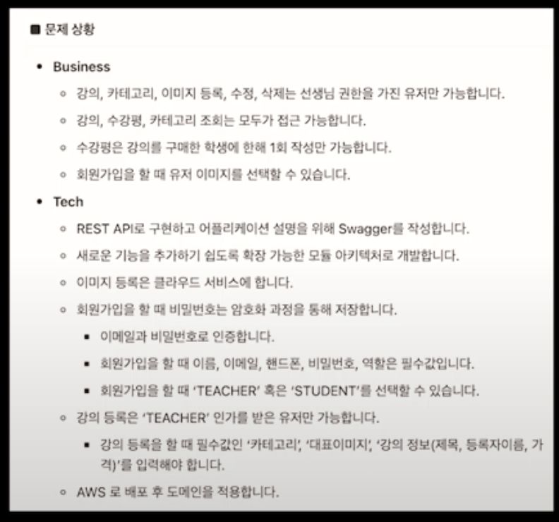
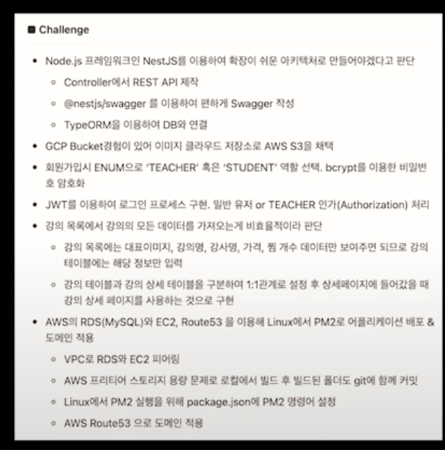
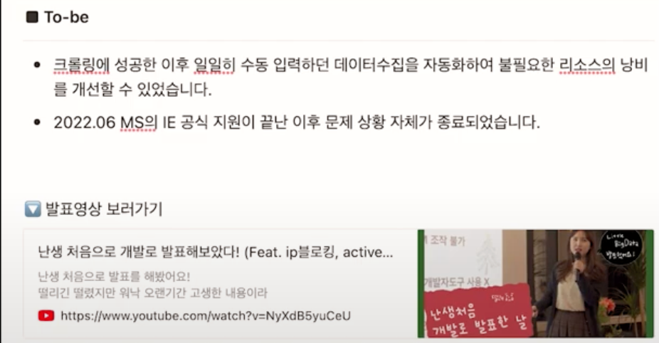

## 1차 이력서 피드백

OKKY 에서 19년차 개발자분이 무료로 멘토링해주신다는 글을 보고 카톡으로 연락을 드리고 막 완성한 이력서와 포트폴리오를 전달드렸다. 곧 답장이 오셨는데 전화번호를 알려달라 하셔서 처음에는당황하였다. 무료로
해주신다해서 그냥 카톡으로 해주시고 마는줄 알았는데 전화까지 주셨다. 좋은 기회여서 바로 전화번호를 드렸고, 그리하여 전화로 멘토링을 받게되었는데...

100% 떨어지는 이력서라고 먼저 말씀해주셔서 사고가 멈추었었다. 사실 이정도면 준수한거 아닌가라고 생각을하고 있었는데... 100%떨어진다고 말씀주신후에 그 이유를 들으니 충분히 납득이 갔다. 정리하자면 이렇다.

- 포트폴리오가 장황하다. 블로그에 넣어야될 내용이다.
- 이력서에 포인트가없다. 니가 기획한거 관심없다.
- 이력서에 내가 할 줄 아는걸 넣어라. 교육에서는 뭘 배웠는지 기술하라.
- 많은거 할줄 아는게 자랑이 아니다. 내가 만든 익스텐션, 프론트부분은 어느정도 실력있는 개발자면 충분히 하기에 임팩트를 못준다. 기본에 충실하라
  대강 이렇다.

하~ 솔직히 멘토링 후 1시간 동안은 좀 울적했었는데 이후에는 이렇게 피드백을 받으니 앞으로 할 일이 명확해져서 좋은거 아니겠냐하는 마인드로 바꾸고 다시 처음부터 이력서와 포트폴리오를 만들기 시작했다. 참
감사한분이다. 마지막에 요즘 경기가 최악이니 포기하지말고 해라는 말씀도 해주시고 너무 감사했다.

## 2곳 중 1곳은 무조건 합격하는 개발자 이력서 만들기

[링크](https://www.youtube.com/watch?v=ifGUz43GjdQ&ab_channel=%EC%9D%B8%ED%94%84%EB%9F%B0inflearn)

- 마음가짐: 낙담하지 않기. 중꺽마...
- 이력서는 dry doc. 미사여구 노
- 컴팩트를 만드는것도 능력
- 뭘 할줄 아는지 표현이 되는가?
- 내용이 개발에 초점을 맞우기. 기획능력이 중요한게 아니다!(나도 너무 기획부분을 강조했음)
- 포트폴리오를 킥으로 쓰기
    - 문제해결 스토리 작성...? 스토리?
    - 문제 해결위해 변화하는 과정
    - 결과적으로 이제 뭘 습득했고 가능한지 이 문제해결을 통해서.
    - AS-IS: 문제상황 인지, 해결하려고 하는 문제, 만들고 싶은 기능
    - Challenge: 해결위해 고민한 내용, 어떻게 기술적으로 해결했는지
    - TO-BE: 아웃풋(결과)

## 잘 못써도 합격하는 개발자 이력서

[링크](https://www.youtube.com/watch?v=FOzAGjqiTc0&t=1s&ab_channel=%EA%B0%9C%EB%B0%9C%EB%B0%94%EB%8B%A5)

- 기술적 이야기 녹일수 있는건 상세링크 넣기
- 기술적 고민, 트레이드오프 고민
- JPA쓰면서 쿼리 개선한거 적고, 인덱싱 고민한거!
- 복잡한 비즈니스로직을 어떻게 작성하고 테스트했는가?

## 9년차 개발자가 알려주는 이력서 작성 꿀팁! | 신입사원 서류 합격의 비밀

[link](https://www.youtube.com/watch?v=OxiIgysnGYY&t=41s&ab_channel=%EA%B0%9C%EB%B0%9C%EC%9E%90%EB%A1%9C%EC%B7%A8%EC%A7%81%ED%95%98%EA%B8%B0)

- 읽기 쉬운 코드르 작성하는 개발자등 컨셉은 악수가 될 수있다. 증거 없으면 하지마라 명분없으면 하지마라
- 기술 스택
    - 너무 많은거 적으면 신뢰도 감소. 한언어 프레임웍하나 제대로 쓰는것도 힘든것
    - 1인분을 원함. 필요로 하는 기술 제대로 써본사람 원한다.
- 블로그
    - 한 두개 열어봐도 대박임
    - 꼼꼼히 안읽음
    - 쓱쓱...
    - 주제하나를 깊이있게 다룬글 을 준비하기
    - 인사이트 노하우 정리 하나를 꼼꼼히
    - cs공부하며 깊이있게 공하고 정리한것도 ㄱㅊ음
- 경력
    - 프로젝트 진행하며 고민한적있냐 문제/해결책/결과
    - 문제
        - 개발하며 겪었을 문제. 사소한거라도...
        - 객관적 수치
    - 해결책
        - 어느정도로 깊이 할지 고민...
        - ! 내가 직접 경험한거를 보여줄 수 있는 수준
        - 최대한 수치
          나 이런거 할 줄 알아요 하는게 이력서

## 금기 
- 무의미한 나열. 구체적인 수치나 경험을 첨가 해라
- 기술위주의 핵심 경험. 어떤 기술 썻다가 아니라 써서 뭘 했다
- 기본적인 crud, oauth, 이따위거 윗쪽에 넣지 말라

> 취업 관련 정보들을 정리한 문서. 계속 업데이트

## 이렇게 하면 서류 불합격

[링크](https://www.youtube.com/watch?v=HJNHySXDKmU&ab_channel=%EC%BD%94%EB%94%A9%EA%B5%AD%EC%88%98)

1. 강점 X 이력서
   처음 소개칸. 자신의 강점이 초반부터 드러나야한다. 수많은 지원서를 면접관들은 평균 7초만 본다고함. 구체적 사례. 직우메 해당하는 강점과 연관시킬것
2. 단순 나열 기술은 별로
   예를들어 api32개 구현 이런거 별로. 플젝하면서 어떤 어려움을 겪었고 어떻게 해결했는지? 위기-> 극복.
3. 시간순서대로 나열된거 별로
   가장 자신있는 플젝을 제일 위로. 결국 이것도 초반 임팩트 문제
4. 너무 긴 줄글 별로
   짧고 간결하게 수치로. 긴 글은 읽기 힘들다. 보는 사람을 생각할 것. 내꺼만 보는게 아님
5. 특이한 포맷, 글씨체 x
   가독성 떨어진다. simple is best
6. 단점 노출
   학점, 비전공 이런거 필수아니면 숨기기. 요구하는게 아니면 굳이 표시하지 말기
7. 일관성 없는 것

## 개발자 이력서에 자주 빠지는 내용들

[링크](https://www.youtube.com/watch?v=fz5g-8P3qRc&list=PL97nOgtbO-dSzzbOx3Gdz08Q5xXVDDGSl&index=2&ab_channel=NewLearning%EB%89%B4%EB%9F%AC%EB%8B%9D))

- 다른 사람들과의 협업 경험. 특히 신입의 경우 다른 사람과 소통이 중요. 소통이 없었다는 느낌이 나면 기업입장에서 걱정
- 포폴 만든 이유. 면접에서 왜 이걸 만들었는지? 특별한 문제를 해결하기 위해 만들었다하는게 매력적이지. 오 마이코딩테스트 플젝 딱이다.
- 실적... 흠... 기존에는 시간1시간걸리는걸 같은일을 30분만에 가능하다. 이걸 수치로 표시하기

## 요즘 개발자 면접에서 모르면 손해보는 3가지

[링크](https://www.youtube.com/watch?v=66hZFp3HBS8&list=PL97nOgtbO-dSzzbOx3Gdz08Q5xXVDDGSl&index=4&ab_channel=%EB%A9%94%ED%83%80%EC%BD%94%EB%93%9CM)

- JD 의 중요성. 기본적 역량은 없어보이는데 사용자 관점에서 개발할 줄 아는 사람을 뽑는 경우도 존재
- 학습 능력, 학습 의지, 열정. 당장은 미흡해도 어려움을 극복하고 습득 가능한가? 본인만의 공부법
- 내가 서비스의 한 축을 담당했을때 고객을 고려하는 사람?

1. 역량적인 부분에서 기본적인 지식
2. 컬쳐핏