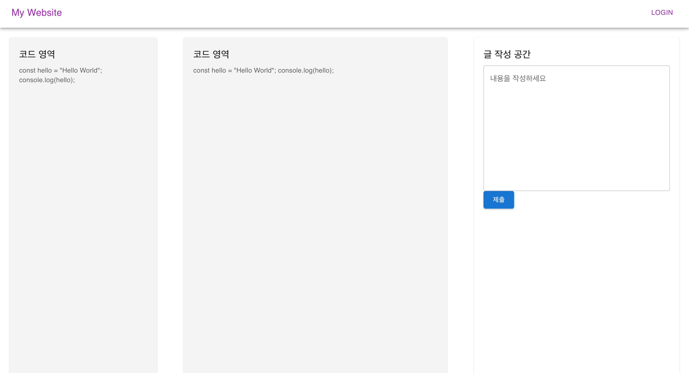
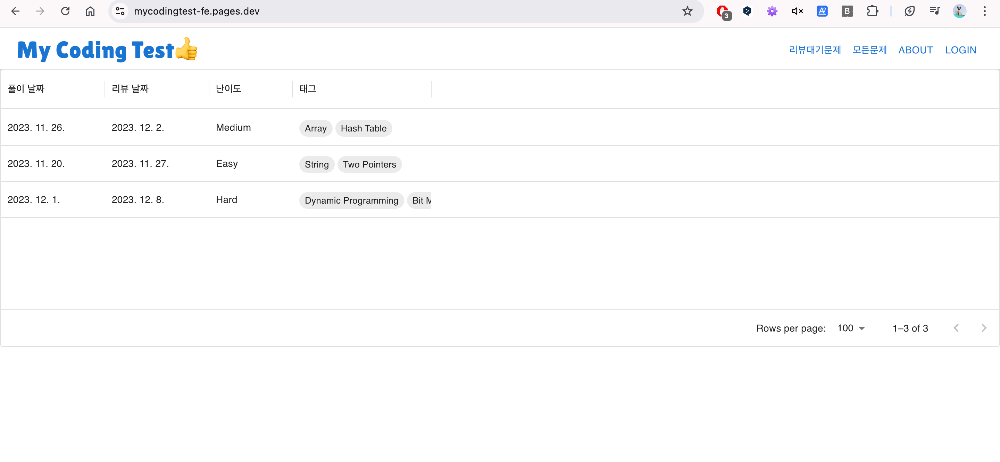
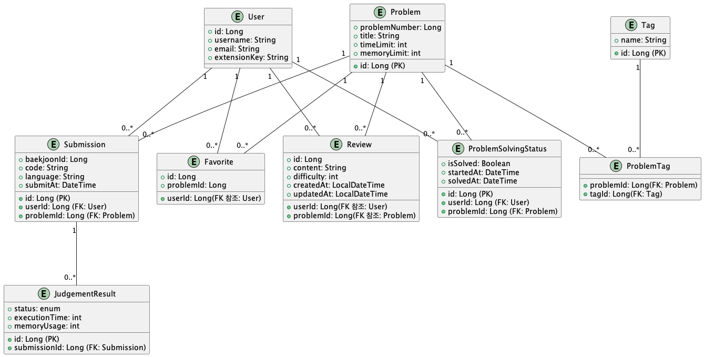
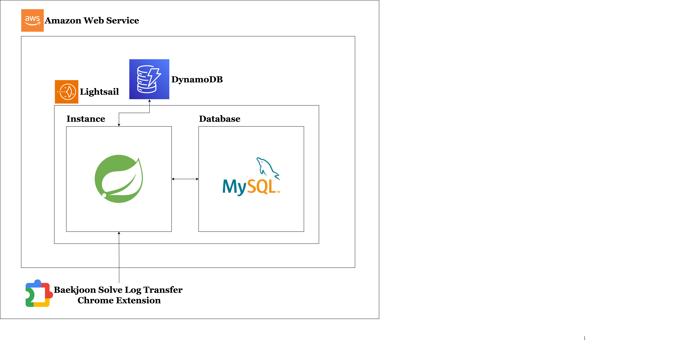
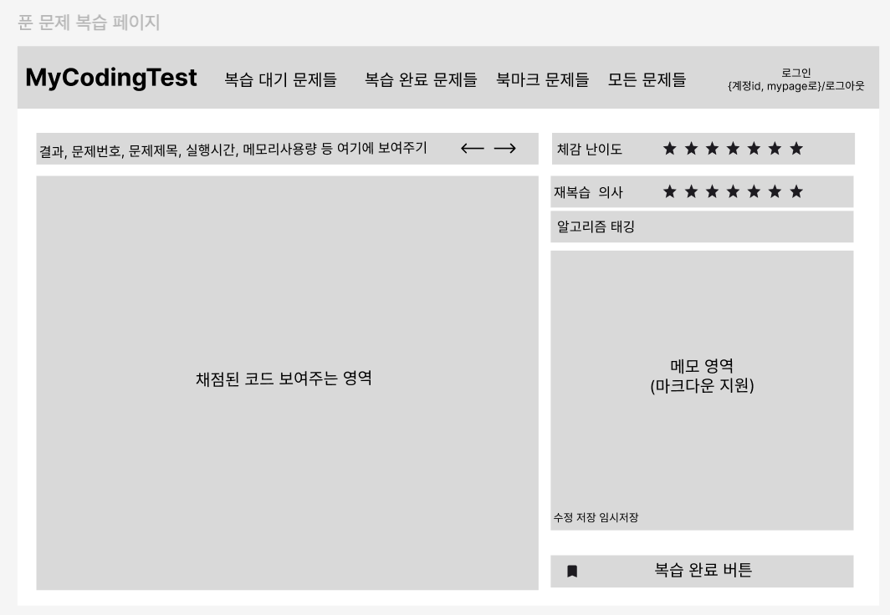

## My Coding Test 프로젝트 일지

### 24.12.23

- 크롬 익스텐션 기초 강의를 유튜브를 통해 시청
- 크롬 익스텐션 공식문서 간단히 훓기
- 간단한 익스텐션은 기본적인 HTML, CSS, Javascript 만 알아도 충분한걸 깨달음
- 크롬 익스텐션으로 백준사이트에서 나의 풀이 코드와 채점 결과를 가져오는것에 성공!
    - 작년에 Java+Selenium 으로 웹크롤러만들어본 경험이 꽤 도움이 됨
    - JavaScript 에 조금 자신감이 붙음
- 깃허브 리포지토리로 등록

### 24.12.24

- 어제 익스텐션 약간의 수정
- 프론트 이번기회에 리액트를 사용해서 컴포넌트기반으로 프론트 구성해보도록 결심
- 코딩앙마, 생활코딩, 코딩애플 유튜브 강의를 통해 기초적인 리액트 지식 습득
    - 작년에는 보아도 도저히 이해가 안갔지만 지금보니 너무 이해가 잘됨. 자신감이 붙음
- MUI를 사용하기로 결정
- 아래는 연습결과
- 24.12.26일까지 프로토타입 만들것
  

### 24.12.25

- 크롬 익스텐션 크게 개선
    - 백준에서는 채점시 여러 상태가 동적으로 표시됨. 예를들어 채점 중, 기다리는 중, 성공, 시간초과 등
    - 조건문에 "채점", "기다리"가 있으면 계속 대기하도록 수정 -> 이제 의도한 채점 결과만 읽어 들인다
    - 제출 코드와 채점 결과를 하나의 JSON으로 함쳐서 서버로 전송하도록 함
    - `localhost:8080/api/1` 로 POST 할것을 지정함
- Java Spring
    - 크롬 익스텐션에서 POST 해줄 JSON을 받아서 DB에 저장할 백엔드
    - H2 데이터베이스를 사용할 예정. 파일모드로 변경하여 영속성이 되도록 수정
- 프론트
    - 어제 연습한거 기반으로 본격적으로 진행할 얘정임
    - vite 로 새로운 리액트 프로젝트 구성 완료
    - 프론트단은 서버와 익스텐션이 어느정도 완성된후에 집중 개발 예정

### 24.12.26

- 크롬 익스텐션에서 전송하는 JSON 속성 수정
- Frontend
    - CRA가 아닌 Vite로 새로 생성한 리액트 프로젝트로 새로 시작. 이전에 만들어 놓은 컴포넌트 옮기는 작업 완료
    - TypeScript 로 변경
        - 써보니 뭔가 계속 error가 뜨기는하지만 정적타입이라서 Java처럼 suggestion 이 잘 되어있다.JavaScript는 항상 브라우저 콘솔을 확인해야했는데 TypeScript는 편집기에서 다
          해결을하고 실행하니 훨씬 좋음
        - 간단한 유투브 강의를 보고 사용하니 도움이 됨
        - 왜 언어는 도구에 불과한지 조금 알겠음. Java가 도움이 된다 TS 익히는데에
    - WriteArea Component
        - 마크다운 기능 적용
        - 마크다운 미리보기 기능 적용
    - CodeArea Componente
        - react-syntax-highlighter 추가
        - 더 나은 코드 가독성
    - GradingResultInfo Component
        - 채점 결과 보여주는 컴포넌트
        - 꽤 크기가 커서 열고 닫는 버튼 추가
- Backend
    - 여러 엔티티를 생성
    - 컨트롤러 정리
    - **문제점**
        - 머릿속에는 대강 그려놓고 테이블 구성하려니 잘 안된다
        - 간단한 서비스라고 생각했는데 아닌것 같다
        - 기능 정리가 필요

### 24.12.27

- react-router-dom 추가
- 라우팅 기능 구현 성공
- 어느정도 프론트 기본기 수련 되었다는 생각이 듬
- 금일은 머리로만 상상하던 기능 요구 사항 마인드맵 등으로 정리
- 처음에는 단순하게 생각한게 사용자의 행위까지 고려하려하니 꽤 생각할거리가 많음
- mui의 x-data-grid 활용하여 FilterableTable Component 구현
    - 라이브러리 참 편하다
    - 공식문서에 설명도 잘 되어 있어서 쓰기가 너무 좋다
    - 디자인, 기능 다 훌륭하다. 내가 원한게 다 있음
- 중간 결과물
  
- ERD 설계도
  
- 이렇게 작성하니 좀 정리가 된다. 이제 백엔드 개발에 속도 붙을거 같음.
- 하루종일 ERD 만드는데 집중. 제대로 만들어진것일까?
- Chrome Extesion에서 만드는 JSON 아래와 같이 수정

```json
{
  "code": "import java.io.BufferedReader;\nimport java.io.IOException;\nimport java.io.InputStreamReader;\nimport java.util.ArrayDeque;\nimport java.util.Arrays;\nimport java.util.Queue;\nimport java.util.StringTokenizer;\n​\nclass Main {\n    static int[] di = {1, -1, 0, 0};\n    static int[] dj = {0, 0, 1, -1};\n​\n    public static void main(String[] args) throws IOException {\n        BufferedReader br = new BufferedReader(new InputStreamReader(System.in));\n        StringTokenizer st = new StringTokenizer(br.readLine());\n        int N = Integer.parseInt(st.nextToken());\n        int M = Integer.parseInt(st.nextToken());\n        st = new StringTokenizer(br.readLine());\n        int[] juNan = {Integer.parseInt(st.nextToken()), Integer.parseInt(st.nextToken()), 0};\n        int[] target = {Integer.parseInt(st.nextToken()), Integer.parseInt(st.nextToken())};\n        if (juNan[0] == target[0] && juNan[1] == target[1]) {\n​\n            System.out.println(0);\n            return;\n        }\n        char[][] map = new char[N + 1][M + 1];\n        for (int i = 1; i <= N; i++) {\n            String s = br.readLine();\n            for (int j = 1; j <= M; j++) {\n                map[i][j] = s.charAt(j - 1);\n            }\n        }\n        map[juNan[0]][juNan[1]] = '0';\n//1을 만나면 0으로 바꾸고\n        Queue<int[]> q = new ArrayDeque<>();\n        q.add(juNan);\n        int[][] visited = new int[N + 1][M + 1];\n        for (int i = 0; i <= N; i++) {\n            Arrays.fill(visited[i], Integer.MAX_VALUE);\n        }\n        visited[juNan[0]][juNan[1]] = 0;\n        int ans = Integer.MAX_VALUE;\n        while (!q.isEmpty()) {\n            int[] poll = q.poll(); // i , j , 여기까지의 누적 가중치\n            if (poll[0] == target[0] && poll[1] == target[1]) {\n                ans = Math.min(ans, poll[2] + 1);\n                continue;\n            }\n            for (int i = 0; i < 4; i++) {\n                int ni = poll[0] + di[i];\n                int nj = poll[1] + dj[i];\n​\n                //다음꺼를 큐에 넣어도 되는지 검증해야한다. 다음꺼!! 지금게 아니라\n                if (ni < 1 || ni > N || nj < 1 || nj > M) continue;\n                int nextWeight = poll[2] + (map[ni][nj] == '1' ? 1 : 0);\n                if (visited[ni][nj] <= nextWeight) continue;\n                visited[ni][nj] = nextWeight;\n                q.add(new int[]{ni, nj, nextWeight});\n            }\n​\n        }\n        System.out.println(ans);\n    }\n}\n​\n",
  "submissionId": "87877658",
  "baekjoonId": "https://www.acmicpc.net/user/zzoe2346",
  "problemId": "https://www.acmicpc.net/problem/14497",
  "resultText": "맞았습니다!!",
  "memory": "299268",
  "time": "888",
  "language": "Java 11 / 수정",
  "codeLength": "2448",
  "submittedAt": "2024년 12월 27일 20:39:23"
}
```

### 24.12.28

- 금일은 집에서 코드, 글 과같은 큰 용량의 데이터를 MySQL같은 곳에 저장시키는게 맞는지에 대한 고민을 함
- 나 혼자 쓰는건 상관없는데 배포를 하여 많은 사람이 쓴다고 생각하면
    - 데이터베이스에 code와 글을 저장하면 저장공간이 금방 부족해 질것임
    - 코드, 글 속성들이 있는 테이블은 JPA로 함부로 엔티티 가져오면 안되겠다는 판단. 왜? 엔티티는 모든 속성을 다 가져오는데 이러면 Lob데이터인 글, 코드도 같이 딸려오기 때문
    - 물론 위와같은걸 방지하려면 따로 글과 코드 테이블 즉 엔티티를 두면되는데 책임이나 역할에 따라 분리하는게 아니라서 OOP에 맞지도 않고 어색한 분리라고 생각이 듬
- 고민하고 검색하고 LLM 의 도움도 받아본 결과 NoSQL을 사용하는것으로 결정.
- 사용해본 MongoDB와 DynamoDB중 DynamoDB를 써보기로 함. 왜냐하면 DynamoDB가 무료로 사용해도 15GB 나 주기 때문. 그에 비해 MongoDB는 겨우 500MB만 준다...
- MongoDB를 작년에 써봤어서 익숙하긴한데 용량차이가 너무 큼. 글과 코드를 저장해야하는데 500MB는 너무 작다.
- 간단히 백엔드 배포 다이어그램 만들어 보았음
  
- 내일부터는 스프링 개발에 집중
- ERD도 약간수정하고서 개발에 몰입하자

### 24.12.28

- 할 일
    - 익스텐션에서 백준 알고리즘 태그, 문제 이름도 읽어서 서버에 전달하는기능 추가
    - 백엔드 구현
    - DynamoDB 스프링과 연동

### 24.12.30

- 금일 진행상황
    - DynamoDB 연동에 성공. 공식문서를 보는게 가장 정확하고 빠르다.
    - 크롬 익스텐션에서 문제의 제목까지 가져오는 기능 추가
    - 크롬 익스텐션에서 보내주는 JSON을 스프링에서 나누어 저장하는 로직 구현 완료
    - 데이터데이스 테이블 구성 생각할게 많은거 같다. 몇일동안 고민했지만 정답은 없는것 같다는 결론을 내림. 지금 설계한것이 최선이라고 여기고 일단은 진행하자. 너무 DB설계때문에 프로젝트가 더뎌지고 있다.
    - Spring Security 적용 중. 저번 프로젝트때는 Intercepter와 JWT로 인증/인가를 구현해본 경험이 있어서 이번엔 프레임워크에서 제공하는 기능 써보려고 한다.

### 24.12.31

- 24년의 마지막일 내년도 열심히 살기
- Spring Security
    - 아 이거 생각보다 할 게 많다. 전에는 이런 프레임워크에서 제공하는거 안쓰고 인터셉터로 JWT 처리하고 카카오로그인api로 소셜로그인은 구현해봤는데 이건 spring security filter
      chain을 좀 이해하고 들어가야 할 듯
    - 일단은 이해보다 구현을 우선순위로 두었다
    - 저녁먹기전에 usernameAndPassword 방식 + JWT 활용해서 인증/인가 기능 구현완료
- 이메일 인증은 후반부로 넘긴다

### 25.01.01

- 어제하던 로그인/회원가입 기능 개선 완료
- 크롬 익스텐션에서 로그인 기능 정상 작동 확인
- 백엔드 대규모 수정
    - 엔티티 설계, 관계 설정 미숙으로 인해 대대적으로 코드를 수정함.
    - 다행히 왜 이상했는지 이해가 되었고 전보다 나은 코드가 됨.
    - 객체(엔티티)간에 관계파악이 중요하구나.
- 프로트 디자인 피그마로 간단히 설계 완료.
  

### 25.01.03

- Swagger 설정 완료
- Swagger 로 모든 기능 정상작동 확인!
- JwtFilter 에서 착각하던거 바로잡음. JwtFilter에서는 토큰 있으면 그걸 검증 없으면? 시큐리티 필터로 바로 던져버린다. 만약 Security Config에서 permit 한게 아니라면 여기서 인가가
  필요한 api 에서는 걸러진다.
- JwtFilter Refactoring 진행. 더 깔끔해진 코드. 가독성 향상.
- 테스트를 어떻게 진행할까? 단위테스트를 하기 보다는 통합테스트에 집중하는게 나을거 같기도하다. 왜냐하면 로직들이 단순하기 때문에
- 내일은...
    - 메일 인증 기능 구현
    - 백엔드 배포 준비
    - 프론트 엔드 디자인 마무리

### 25.01.04

- GitHub Actions 로 CI/CD 성공. EC2로 배포되어 Swagger 문서 잘 배포하는 것 확인!
- MS Azure 에서 VM하나 빌림 1g RAM, 2vCPU 인데 MySQL 용으로 일단 쓰려고함

### 25.01.05

- JWT를 사용하는데 이상하게 헤더에 JWT를 넣어 api를 요청함에도 계속 User DB를 hit하는 현상을 발견
    - JwtFilter 로직에서 DB에 접근하는 로직을 발견하여 수정
- Spring Security 관련 코드 수정
- JWT Payload 에 유저 관련 정보 추가
- 고려할게 왜이렇게 많을까; 혼자 쓰는 애플리케이션이었으면 그냥 끝냈을거 같은데 실제로 배포할 계획을 가지고 있으니 편의성, 보안 등 생각할 요소가 계속 생긴다
- 우선 크롬 익스텐션 이거 마무리 지어보자 이제
    - 기존에 크롬 로컬 스토리지에 저장하던 Jwt를 쿠키로 관리하도록 변경한다.
    - JS 코드 개선한다.
    - 백준 코드 채점결과 화면에서 이미 제출된 거면 서버에 제출하지않는 로직 추가
    - popup 로그인 로그아웃 화면 개선
    - 개발자 등록하고 구글에 검토요청 날리기
- 현재 권한검증 로직이 다 빠져있음 이것도 넣여야한다.!
- JWT 관리 전략 대폭 수정
    - 기존
        - 브라우저 로컬 스토리지에 저장
        - 보안에 매우 취약. 악성 스크립트가 있을시 로컬 스토리지에 접근해서 토큰을 습득한뒤 멋대로 api 호출 가능
    - 개선
        - HttpOnly 쿠키를 활용
        - 이제 스크립트가 JWT 접근 불가
        - 쿠키는 자동으로 브라우저에서 저장되고, fetch에서 include 설정 세팅을 하면 origin 에 include 되는 쿠키 자동으로 넣어서 백엔드에 요청이 가능해서 코드를 덜 짜도 된다
        - 이제 그냥 웹사이트에 로그인만하면 크롬 익스텐션 사용이 가능해짐. 이전까지는 크롬 익스텐션에서도 로그인을 요구했는데 로그인 요구를 절반으로 줄임
        - 그리고 로그인시 제공되는 Jwt도 일반 토큰과 같았다면 이제는 role을 제한함으로서 사용할수 잇는 api 를 제한했다. 보안성 up

### 25.01.06

- 로그인 페이지 구현 완료!!!
    - 전역 상태 관리를 하여 유저로그인 상태를 관리하게 하였다. 처음 맞딱드린 개념이었는데 다행히 오늘 내로 구현에 성공했다.
    - localhost에 https를 간단히 적용하였다. 쿠키가 httpOnly, secure 등등 보안을 설정하면 참 까다로운거 같다. 조금이라도 틀어지면 응답에 쿠키가 있어도 브라우저에 등록이 안되다던가
      아예 헤더에 쿠키가 없는경우도 있고... 마음편히 프론트, 백 둘다 http, https인 환경에서 테스트 하기위해 프론트는 cloudflare로 배포시 자동으로 ssl 적용이 되고, 백은 그냥 로컬에서
      mkcert라는 프로그램으로 간단히 ssl을 localhost에 적용시켰다.
- 로그인 구현하는데 하루종일 매달렸다. 그래도 기존의 로컬스토리지가 아닌 HttpOnly 쿠키로 보안성이 높아진 로그인 구현을 하여 충만한 느낌이다.
- 까다로운 로그인 구현 완료하였으니 이제 본격적으로 서비스 페이지, 컴포넌트 개발 시작 해보자