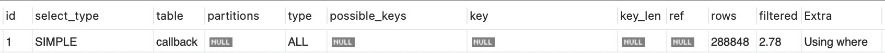
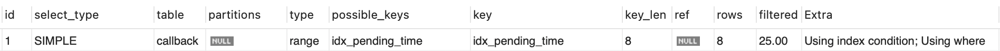
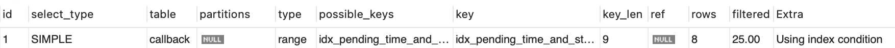
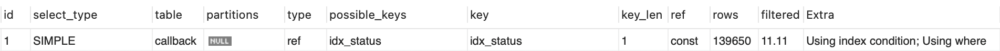

## 문제 정의

- Callback Entity 에 status 속성이 존재
- status 는 'PENDING COMPETE(완료 대기)'인 상태로 **2일이 지나면 자동**으로 'COMPLETE(완료)' 상태로 전환되도록 서비스 정책을 결정
- `@Scheduled` 로 10분마다 DB를 조회하고 조회 기준시간으로 status가 'PENDING COMPETE(완료 대기)' 이고 이 상태로 2일 이상 유지되었다면  'COMPLETE(완료)'로 바뀌는 로직
  구현 상태
- 문제는 데이터가 누적이 되면 10분마다 하는 조회가 서버에 부담을 주고 결국 서비스에 예기치 않은 장애를 일으키지 않을까 하는 우려

## 문제 분석

- 조회 쿼리를 보면 테이블 전체를 조회하기에 데이터가 커질수록 O(N) 으로, 성능 저하가 자명

## 문제 해결 과정

고민을 해보다가 마침 멘토링할 수 있는 기회가 생겨 멘토님께 이 문제를 어떻게 해결할 수 있을지 질문드려보았는데요. 이런 답을 주셨습니다.

- index 적용
- EXPLAIN 을 활용하여 데이터베이스의 실행 계획 분석

저는 index는 여러 책과 유튜브등에서 접해보았지만 실제로 사용해본적은 없었고, EXPLAIN이라는 쿼리는 사실 고급 개발자만 하는게 아닌가하는 두려움이 있었습니다.

하지만 멘토님께서 우리 학생들이 못할 만 한걸 추천해주었을 리가 없다는 생각과 별거아니겠지하는 생각으로 공부를 진행하였고 생각보다 할 만하다고 생각이 되었습니다.

간단히 학습을 마친후, 저는 아래와 같은 사항을 실험해보고 싶은 생각이 들었고 실천하였습니다.

- 인덱스를 어느 속성에 적용해야 최적의 성능개선이 되는가?

### 실험 준비

#### JPA가 Callback Entity 생성시 실제 만드는 쿼리

```sql
CREATE TABLE callback
(
    assigned_member_id    BIGINT,
    id                    INT AUTO_INCREMENT,
    pending_complete_time TIMESTAMP(6),
    post_time             TIMESTAMP(6),
    senior_id             BIGINT NOT NULL,
    status                ENUM('COMPLETE', 'IN_PROGRESS', 'PENDING_COMPLETE', 'WAITING') NOT NULL,
    PRIMARY KEY (id)
);
```

#### JPA가 실행하는 조회 쿼리

```sql
SELECT SQL_NO_CACHE callback.id, callback.assigned_member_id,
       callback.pending_complete_time,
       callback.post_time,
       callback.senior_id,
       callback.status
FROM callback
WHERE callback.pending_complete_time BETWEEN '2023-03-24 18:31:00' AND '2023-03-24 18:41:00'
  AND callback.status = 'PENDING_COMPLETE';
```

#### 실험을 위한 더미데이터 삽입을 위한 Procedure

```sql
BEGIN
    DECLARE
v_counter INT DEFAULT 0;
    
    WHILE
v_counter < 300000 DO
        INSERT INTO callback (assigned_member_id, pending_complete_time, post_time, senior_id, status)
        VALUES (
            FLOOR(RAND() * 10000),
            NOW() - INTERVAL FLOOR(RAND() * (3 * 365 * 24)) HOUR,  -- 3년 전까지 랜덤 pending_complete_time
            NOW() - INTERVAL FLOOR(RAND() * (3 * 365 * 24)) HOUR,  -- 3년 전까지 랜덤 post_time
            FLOOR(RAND() * 10000),  -- 랜덤 senior_id
            ELT(FLOOR(RAND() * 4) + 1, 'COMPLETE', 'IN_PROGRESS', 'PENDING_COMPLETE', 'WAITING')  -- 랜덤 status
        );
        
        SET
v_counter = v_counter + 1;  -- 카운터 증가
END WHILE;
END
```

#### 실험 목적 : 인덱스를 어느 속성에 적용해야 최적의 성능개선이 되는가?

- 기간: 이전 3년
- 데이터양: 300,000 건

#### 인덱스 미적용시 평균 시간과 EXPLAIN 결과

- 평균 시간
    - 0.142 sec
- EXPLAIN 결과
  

#### 인덱싱 적용 1: `PENDING COMPLETE TIME`만 인덱싱

- 평균 시간
    - 0.00086 sec
- EXPLAIN 결과
  

#### 인덱싱 적용 2: `PENDING COMPLETE TIME`, `STATUS`를 복합 인덱싱

- 평균 시간
    - 0.00073 sec
- EXPLAIN 결과



#### 인덱싱 적용 3: `STATUS`만 인덱싱

- 평균 시간
    - 0.139 sec
- EXPLAIN



## 결과

인덱스를 적용한 3개의 경우중에서 2번째(`PENDING COMPLETE TIME`,`STATUS` 인덱싱)가 쿼리 실행시 검사 할`rows`가 8으로 작고,`Using index condition`만 존재하여
절차가 다른 쿼리에 비해 짧은거 같아 가장 성능이 좋을것으로 예상되었는데 막상 평균내보니 1번째( `PENDING COMPLETE TIME` 인덱싱)와 비슷하거나 오히려 약간 느린 상황이 확인되었습니다.

`status` 컬럼이 `enum`이고 값을 4가지만 가져서 ==카디널리티가 낮아 인덱싱 효율이 낮아서== 이런 결과가 나온것으로 예상이 됩니다.

## 결론

이런 경우 속도차이는 크게없고, 2번째(`PENDING COMPLETE TIME`,`STATUS` 인덱싱)가 복합인덱싱을 하는데 리소스를 더 쓰니 1번째( `PENDING COMPLETE TIME` 인덱싱)로 인덱싱
전략을 선택하는게 타당하다는 결론이 도출됩니다.

## 궁금한 부분

- 인덱스를 적용하면 조회 측면에서 큰 이득을 보지만, update 에서 손해를 본다. 이런 트레이드 오프에 대한 기준이 있을까?

## 참고한 자료들

아래 서적들을 참고하였습니다. 모두 큰 도움을 받아 추천드립니다.

- [MySQL 성능 최적화](https://m.yes24.com/Goods/Detail/112622445)
- [SQL 레벨업](https://m.yes24.com/Goods/Detail/24089836)
- [업무에 바로 쓰는 SQL 튜닝](https://www.yes24.com/Product/Goods/102382080)
- [데이터베이스르 지탱하는 기술](https://www.yes24.com/Product/Goods/7957807)
